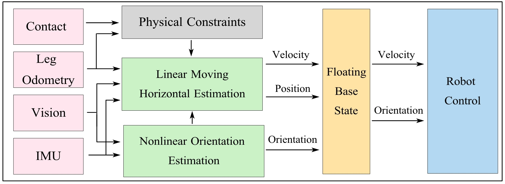

# Decentralized_EKF_MHE
## Fast Decentralized State Estimation for Legged Robot Locomotion via EKF and MHE

In this project, the nonlinear estimation of the floating base states is decentralized to an orientation estimation via Extended Kalman Filter (EKF) and a linear velocity estimation via Moving Horizon Estimation (MHE). The EKF fuses the inertia sensor with vision to estimate the floating base orientation. The MHE uses the estimated orientation with all the sensors within a time window in the past to estimate the linear velocities based on a time-varying linear dynamics formulation of the interested states with state constraints. This decoupling of state estimation promotes the desired balance of computation efficiency, accuracy of estimation, and the inclusion of state constraints. The proposed method is shown to be capable of providing accurate state estimation to several legged robots, including the highly dynamic hopping robot PogoX, the bipedal robot Cassie, and the quadrupedal robot Unitree Go1, with a frequency at 200 Hz and a window interval of 0.1s.

For more details, please refer to the paper. [[arxiv](http://www.arxiv.org/abs/2405.20567)] [[youtube](https://www.youtube.com/watch?v=k3bBO87UIlk)]



## Prerequisites

#### Ubuntu 20.04

#### [ROS2](https://docs.ros.org/en/galactic/index.html) (tested with foxy/galactic)

#### Eigen3

#### [OSQP](https://osqp.org/docs/get_started/)

#### [OpenCV 4.2.0](https://opencv.org/) 

#### [ORB_SLAM3](https://github.com/UZ-SLAMLab/ORB_SLAM3)

Go to this [[repo](https://github.com/zang09/ORB-SLAM3-STEREO-FIXED)] and follow build instruction. 

#### [ORB_SLAM3_ROS2](https://github.com/zang09/ORB_SLAM3_ROS2?tab=readme-ov-file)

Go to this [[repo](https://github.com/zang09/ORB_SLAM3_ROS2?tab=readme-ov-file)] and follow build instruction. 

#### [FROST](https://ayonga.github.io/frost-dev/pages/installation.html)
FROST is used to generate kinematics libraries for the project.

## Install
```bash
mkdir ~/ros2_ws
cd ~/ros2_ws
git clone https://github.com/well-robotics/Decentralized_EKF_MHE.git
colcon build --cmake-args -DCMAKE_BUILD_TYPE=Release --symlink-install
```
## Launch Example
```bash
ros2 launch go1_example go1_launch.py
```

